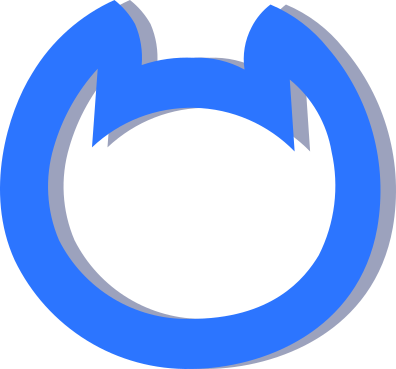

Hi My name is Eiliya Keshtkar
==============================================================================================================================================

Offensive security researcher
--------------------------

Backend Developer and Web Pentester

* 🌍  I'm based in Tehran, Iran
* ✉️  You can contact me at [eiliyakeshtkar0@gmail.com](mailto:eiliyakeshtkar0@gmail.com)
* 🧠  I'm learning GoLang, Chatbot, Mobile Pentest

### OS:

| Linux | Ubuntu | Kali |
|----------|----------|----------|
|  |  |  |

### Tools for CTF's
 
| Metasploit | Wireshark | Burpsuite | Netcat | Nmap |
|----------|----------|----------|----------|----------|
||||||

### Socials

  

### Latest Blog posts
<!-- BLOG:START -->
- [Web Cache Poisoning](https://unk9vvn.com/2021/07/web-cache-poisoning/)
<!-- BLOG:END -->

### My GitHub Stats

